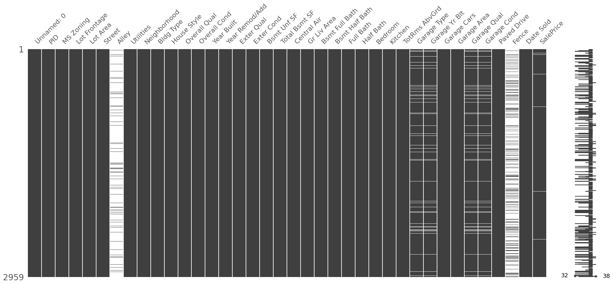
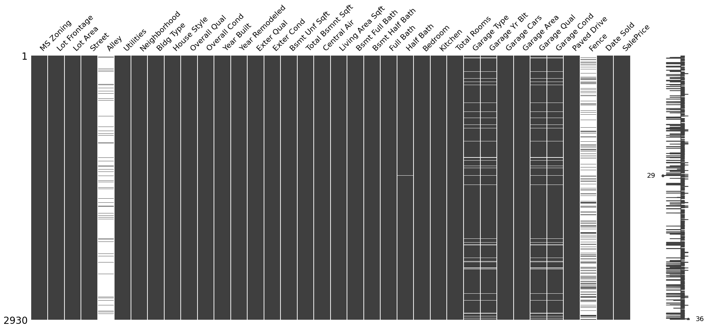
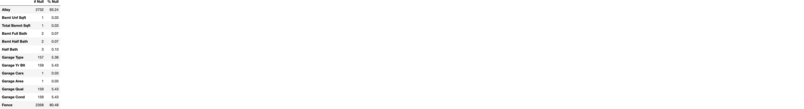

<a href="https://colab.research.google.com/github/coding-dojo-data-science/Example-Project-Analyzing-Ames-Housing/blob/main/Example_Ames_CRISP_DM_Project_Notebook_Part1.ipynb" target="_parent"></a>

# Analyzing House Prices in Ames Iowa
Part 1: Business Understanding and Data Understanding (pre-EDA)

- Student Name: Example Project

# Introduction

<center>

<a href="https://dolinskigroup.com/buy-home/sellers-concessions">Image Source</a></center>

We've been hired by a group of homeowners who are concerned about the value of their homes decreasing before they sell them. They have asked us to take the raw house price data from their hometown, Ames, Iowa to be able to give them data-driven recommendations on how to best increase the value of their home.


We will be following the CRISP-DM workflow for our analysis.  

<center>


<a href="https://www.datascience-pm.com/crisp-dm-2">Image Source</a></center>


## Table of Contents

- [Phase 1) Business Understanding](#phase1)
- [Phase 2) Data Understanding](#phase2)


<a name='phase1'></a>
# Phase 1) Business Understanding


**Our stakeholders are:**
- People who already own homes in Ames, Iowa

**Their primary goal is:**
- Increase the resale value of their homes.

**They plan to:**
- Modify/renovate their homes based on our analysis.

**What do they need/expect?**
- Actionable insights/recommendations for which modifications they can make to increase the price of their homes.


<a name='phase2'></a>
# Phase 2) Data Understanding


## 2.1) What data have we been provided?


<p>The stakeholders have provided us with two links:</p>
<ul><li> <a href="https://drive.google.com/file/d/1Jach7HsZVywhJnUJmkyqje52ho_0VJgo/view?usp=sharing" target="_blank">Share URL to a .csv file</a> <ul><li>A spreadsheet of various features of homes in their town, as well as the price of the house at the time of sale. </li></ul></li><li><a href="https://docs.google.com/document/d/1nmnel7g35aMOl0mKiSsTHXT8wRzbJ1EktKNqYFEmpWE/edit?usp=sharing" target="_blank">A Data Dictionary File</a><ul><li>A data dictionary is a document that lists the name and explanation for every feature in a dataset.</li></ul></li></ul>
<p>(Note, this is a modified version of the original Ames Iowa Housing dataset found on <a href="https://www.kaggle.com/datasets/marcopale/housing" target="_blank">Kaggle</a>)</p>


```python
from google.colab import drive
drive.mount('/content/drive', force_remount=True)
```

    Mounted at /content/drive


```python
# Import standard packages
import pandas as pd
import numpy as np
import matplotlib as mpl
import matplotlib.pyplot as plt
import seaborn as sns
pd.set_option('display.max_columns',100)

import missingno as msno
## Setting the max_columns to 50
pd.set_option('display.max_columns',50)
```


```python
from sklearn import set_config
set_config(transform_output='pandas')
```


```python
# Load in the data
fpath = "/content/drive/MyDrive/CodingDojo/01-Fundamentals/Week02/Data/ames-housing-dojo.csv"
df = pd.read_csv(fpath)
# Preview first 5 rows
df.head()
```


    

    


## **2.2) What information is included in the data?**


Overview:
- How many records (rows)?
- How many features (columns)?
- What is each feature's format/data type (string/integer/etc.)?
- What is the meaning of each feature (how does it relate to the stakeholder’s goals?)


```python
df.info()
```

    <class 'pandas.core.frame.DataFrame'>
    RangeIndex: 2959 entries, 0 to 2958
    Data columns (total 38 columns):
     #   Column          Non-Null Count  Dtype  
    ---  ------          --------------  -----  
     0   Unnamed: 0      2959 non-null   int64  
     1   PID             2959 non-null   int64  
     2   MS Zoning       2959 non-null   object 
     3   Lot Frontage    2959 non-null   int64  
     4   Lot Area        2959 non-null   int64  
     5   Street          2959 non-null   object 
     6   Alley           201 non-null    object 
     7   Utilities       2959 non-null   object 
     8   Neighborhood    2959 non-null   object 
     9   Bldg Type       2959 non-null   object 
     10  House Style     2959 non-null   object 
     11  Overall Qual    2959 non-null   int64  
     12  Overall Cond    2959 non-null   int64  
     13  Year Built      2959 non-null   int64  
     14  Year Remod/Add  2959 non-null   int64  
     15  Exter Qual      2959 non-null   object 
     16  Exter Cond      2959 non-null   object 
     17  Bsmt Unf SF     2958 non-null   float64
     18  Total Bsmt SF   2958 non-null   float64
     19  Central Air     2959 non-null   object 
     20  Gr Liv Area     2959 non-null   object 
     21  Bsmt Full Bath  2957 non-null   float64
     22  Bsmt Half Bath  2957 non-null   float64
     23  Full Bath       2959 non-null   int64  
     24  Half Bath       2959 non-null   object 
     25  Bedroom         2959 non-null   int64  
     26  Kitchen         2959 non-null   int64  
     27  TotRms AbvGrd   2959 non-null   int64  
     28  Garage Type     2802 non-null   object 
     29  Garage Yr Blt   2800 non-null   float64
     30  Garage Cars     2958 non-null   float64
     31  Garage Area     2958 non-null   float64
     32  Garage Qual     2800 non-null   object 
     33  Garage Cond     2800 non-null   object 
     34  Paved Drive     2959 non-null   object 
     35  Fence           574 non-null    object 
     36  Date Sold       2959 non-null   object 
     37  SalePrice       2937 non-null   float64
    dtypes: float64(8), int64(12), object(18)
    memory usage: 878.6+ KB


- The file had 2,959 rows and 38 columns.
- There is a mixture of datatypes:
  - 8 float
  - 12 float
  - 18 object

  
- Since numeric features are sometimes stored as object dtype, we will inspect the object columns next and look for columns that should be converted.

### Inspecting Object Columns for Numeric Features 


```python
# Preview all object columns
df.select_dtypes("object").head()
```


    

    


- **Object columns that should be converted to numeric:**
  - [ ] Half Bath
  - [ ] Living Area Sqft (after removing"sqft" from each row)

### Converting Object Columns to Numeric

#### Half Bath


```python
try:
  df["Half Bath"] = df['Half Bath'].astype(float)
except Exception as e:
  display(e)
```


    ValueError("could not convert string to float: '?'")


- There is a "?" that cannot be converted to float, which we will replace with a NaN.


```python
# Replace the "?" with a null value and convert to float
df['Half Bath'] = df['Half Bath'].replace("?",np.nan)
df["Half Bath"] = df['Half Bath'].astype(float)
```

#### Gr Living Area


```python
## Removing the units (sqft) before and convert to float
df['Gr Liv Area'] = df['Gr Liv Area'].str.replace("sqft",'')
df['Gr Liv Area'] = df['Gr Liv Area'].astype(float)
```


```python
# Confirm no additional object cols to convert
df.select_dtypes('object').head()
```


    

    


### **What is the meaning of each feature?**


Please see the <a href="https://docs.google.com/document/d/1nmnel7g35aMOl0mKiSsTHXT8wRzbJ1EktKNqYFEmpWE/edit?usp=sharing" target="_blank">Data Dictionary File</a> for full details.


**After consulting the data dictionary, we noticed there are 2 features not included in the data dictionary:**
- [ ] **"Unnamed: 0"**: There is an erroneous index column that is not in the data dictionary, and should be dropped.


- [ ] **"PID"** column that is not included in the data dictionary.
  - Based on the preview above it looks like it may be a unique identifier, and can be either dropped or used as the index after checking for duplicates.


**There were several features with ambiguous column names.**
The following will be renamed for clarity:
  - "Year Remod/Add" -> "Year Remodeled"
  - "Bsmt Unf SF" -> "Bsmt Unf Sqft"
  - "Total Bsmt SF" -> "Total Bsmnt Sqft"
  - "TotRms AbvGrd" -> "Total Rooms"
  - "Gr Liv Area" -> "Living Area Sqft"


```python
# Dropping index column
df = df.drop(columns=['Unnamed: 0'])
df
```


    

    


```python
## Rename features with more intuitive names
rename_dict = {"Year Remod/Add":"Year Remodeled",
               "Bsmt Unf SF": "Bsmt Unf Sqft",
               "Total Bsmt SF": "Total Bsmnt Sqft",
               "TotRms AbvGrd": "Total Rooms",
               "Gr Liv Area":"Living Area Sqft"}

df = df.rename(rename_dict,axis=1)
df.head()
```


    

    


```python
# Code for creating markdown table for readme
rename_table = pd.DataFrame({'Original Column': rename_dict.keys(),
                             "Renamed Column": rename_dict.values()})
rename_table.to_markdown(index=False)
```


    '| Original Column   | Renamed Column   |\n|:------------------|:-----------------|\n| Year Remod/Add    | Year Remodeled   |\n| Bsmt Unf SF       | Bsmt Unf Sqft    |\n| Total Bsmt SF     | Total Bsmnt Sqft |\n| TotRms AbvGrd     | Total Rooms      |\n| Gr Liv Area       | Living Area Sqft |'


## **2.3) How clean is the data?**


### Are there duplicate rows?


```python
# Include the first row along with all dupicates
duplicated_rows = df.duplicated()
duplicated_rows.sum()
```


    7


- [ ] There were 7 duplicate rows that we will drop.


```python
# # Display duplicates 
# df[duplicated_rows].sort_values("PID")
```


```python
## Drop duplicates
df = df.drop_duplicates()
df.duplicated().sum()
```


    0


- Checking for duplicate PID's. 


Because we have already removed rows that were identical for every feature, we know that there will be differences between the features for any rows with duplicate PIDs.

Therefore, we will specify keep=False in df.duplicated() so we can see compare the rows that share a PID.


```python
## Check unique id col for duplicates'
duplicated_pids = df.duplicated(subset=['PID'], keep=False)
duplicated_pids.sum()
```


    44


- There are 22 rows with duplicate PID's (44 total). 

- To find which duplicate rows to drop, we will filter for the duplicate and sort by PID to align the rows by PID, so we can compare the values in each feature.


```python
# Visualizing duplicates
df[duplicated_pids].sort_values("PID")
```


    

    


- In the 44 rows with duplicate PID rows, each duplicate had a duplicate PID that had a NaN for SalePrice.
  - A) We cannot have null values in SalePrice since it is our target, so we will drop null values from SalePrice only.
  - B) Also, by dropping the rows with null SalePrice, we may also remove the duplicate PID's.
  
- So we first drop null values from SalePrice and then check if there are still remiaining duplicate PID's.


```python
# checking # of null values in SalePrice
df['SalePrice'].isna().sum()
```


    22


```python
# Dropping Null values from SalePrice
df = df.dropna(subset=["SalePrice"])
df['SalePrice'].isna().sum()
```


    0


```python
# Confirming  no more duplicated PIDs
df.duplicated(subset=['PID'], keep=False).sum()
```


    0


- We have successfully removed rows with duplicate PID's while remoing null values for SalePrice.

#### Confirming PID is unique (to make it the index)

While we could drop PID and use the original integer index for the DataFrame, it would be better to use a true unique identifier that came from the original data source. 


```python
# Checking if PID is 100% unique
df['PID'].nunique()/len(df) * 100
```


    100.0


```python
# Making PID the index
df = df.set_index("PID")
df
```


    

    


### Are there missing values?


```python
## Check for Null values
null_counts = df.isna().sum()
null_counts
```


    MS Zoning              0
    Lot Frontage           0
    Lot Area               0
    Street                 0
    Alley               2732
    Utilities              0
    Neighborhood           0
    Bldg Type              0
    House Style            0
    Overall Qual           0
    Overall Cond           0
    Year Built             0
    Year Remodeled         0
    Exter Qual             0
    Exter Cond             0
    Bsmt Unf Sqft          1
    Total Bsmnt Sqft       1
    Central Air            0
    Living Area Sqft       0
    Bsmt Full Bath         2
    Bsmt Half Bath         2
    Full Bath              0
    Half Bath              3
    Bedroom                0
    Kitchen                0
    Total Rooms            0
    Garage Type          157
    Garage Yr Blt        159
    Garage Cars            1
    Garage Area            1
    Garage Qual          159
    Garage Cond          159
    Paved Drive            0
    Fence               2358
    Date Sold              0
    SalePrice              0
    dtype: int64


```python
# Getting nulls as percent of total vallues
null_percent = null_counts/len(df) * 100
null_percent
```


    MS Zoning            0.000000
    Lot Frontage         0.000000
    Lot Area             0.000000
    Street               0.000000
    Alley               93.242321
    Utilities            0.000000
    Neighborhood         0.000000
    Bldg Type            0.000000
    House Style          0.000000
    Overall Qual         0.000000
    Overall Cond         0.000000
    Year Built           0.000000
    Year Remodeled       0.000000
    Exter Qual           0.000000
    Exter Cond           0.000000
    Bsmt Unf Sqft        0.034130
    Total Bsmnt Sqft     0.034130
    Central Air          0.000000
    Living Area Sqft     0.000000
    Bsmt Full Bath       0.068259
    Bsmt Half Bath       0.068259
    Full Bath            0.000000
    Half Bath            0.102389
    Bedroom              0.000000
    Kitchen              0.000000
    Total Rooms          0.000000
    Garage Type          5.358362
    Garage Yr Blt        5.426621
    Garage Cars          0.034130
    Garage Area          0.034130
    Garage Qual          5.426621
    Garage Cond          5.426621
    Paved Drive          0.000000
    Fence               80.477816
    Date Sold            0.000000
    SalePrice            0.000000
    dtype: float64


```python
## Combining null_counts and null_percent above
null_report = pd.DataFrame({'# Null':null_counts,
                            '% Null':null_percent}).round(2)
null_report
```


    

    


```python
# Visualizing Missing Values with missingno
msno.matrix(df)
```


    <Axes: >


    

    


- In the missingno matrix plot, we can see that there are only a few columns that have missing values. Of these columns, 2 seem to have primarily null values ("Alley" and "Fence"). 

- Below, we will display the null value counts and percentages for only the column with null values:


```python
## filtering for only columns with null values
null_report[ null_report['# Null']>0]
```


    

    


#### Null Value Observations:
- Alley and Fence have a large percentage of null values (93% and 80%, respectively).
- For Garage Columns (Garage Type, Garage Yr Built, Garage Qual, Garage Cond), the same rows are null values for all of these columns.
  - This likely indicates that these homes did not have a Garage.


### Are there any features with inconsistent values?


#### Checking Categorical Features for Inconsistencies


```python
# Identify string columns
cat_cols = df.select_dtypes("object").columns
cat_cols
```


    Index(['MS Zoning', 'Street', 'Alley', 'Utilities', 'Neighborhood',
           'Bldg Type', 'House Style', 'Exter Qual', 'Exter Cond', 'Central Air',
           'Garage Type', 'Garage Qual', 'Garage Cond', 'Paved Drive', 'Fence',
           'Date Sold'],
          dtype='object')


```python
# Obtain the value counts for all string columns
for col in cat_cols:
  print(f"Value Counts for {col}")
  print(df[col].value_counts(dropna=False))
  # Increasing readability by adding an empty line
  print('\n')
```

    Value Counts for MS Zoning
    RL         2273
    RM          462
    FV          139
    RH           27
    C (all)      25
    I (all)       2
    A (agr)       2
    Name: MS Zoning, dtype: int64
    
    
    Value Counts for Street
    Pave    2918
    Grvl      12
    Name: Street, dtype: int64
    
    
    Value Counts for Alley
    NaN     2732
    Grvl     120
    Pave      78
    Name: Alley, dtype: int64
    
    
    Value Counts for Utilities
    AllPub    2927
    NoSewr       2
    NoSeWa       1
    Name: Utilities, dtype: int64
    
    
    Value Counts for Neighborhood
    NAmes      443
    CollgCr    267
    OldTown    239
    Edwards    194
    Somerst    182
    NridgHt    166
    Gilbert    165
    Sawyer     151
    NWAmes     131
    SawyerW    125
    Mitchel    114
    BrkSide    108
    Crawfor    103
    IDOTRR      93
    Timber      72
    NoRidge     71
    StoneBr     51
    SWISU       48
    ClearCr     44
    MeadowV     37
    BrDale      30
    Blmngtn     28
    Veenker     24
    NPkVill     23
    Blueste     10
    Greens       8
    GrnHill      2
    Landmrk      1
    Name: Neighborhood, dtype: int64
    
    
    Value Counts for Bldg Type
    1Fam      2425
    TwnhsE     233
    Duplex     109
    Twnhs      101
    2fmCon      62
    Name: Bldg Type, dtype: int64
    
    
    Value Counts for House Style
    1Story    1481
    2Story     873
    1.5Fin     314
    SLvl       128
    SFoyer      83
    2.5Unf      24
    1.5Unf      19
    2.5Fin       8
    Name: House Style, dtype: int64
    
    
    Value Counts for Exter Qual
    TA    1799
    Gd     989
    Ex     107
    Fa      35
    Name: Exter Qual, dtype: int64
    
    
    Value Counts for Exter Cond
    TA    2549
    Gd     299
    Fa      67
    Ex      12
    Po       3
    Name: Exter Cond, dtype: int64
    
    
    Value Counts for Central Air
    Y      2697
    N       191
    yes      37
    no        5
    Name: Central Air, dtype: int64
    
    
    Value Counts for Garage Type
    Attchd     1731
    Detchd      782
    BuiltIn     186
    NaN         157
    Basment      36
    2Types       23
    CarPort      15
    Name: Garage Type, dtype: int64
    
    
    Value Counts for Garage Qual
    TA     2615
    NaN     159
    Fa      124
    Gd       24
    Po        5
    Ex        3
    Name: Garage Qual, dtype: int64
    
    
    Value Counts for Garage Cond
    TA     2665
    NaN     159
    Fa       74
    Gd       15
    Po       14
    Ex        3
    Name: Garage Cond, dtype: int64
    
    
    Value Counts for Paved Drive
    Y    2652
    N     216
    P      62
    Name: Paved Drive, dtype: int64
    
    
    Value Counts for Fence
    NaN      2358
    MnPrv     330
    GdPrv     118
    GdWo      112
    MnWw       12
    Name: Fence, dtype: int64
    
    
    Value Counts for Date Sold
    07-2006    122
    06-2009    112
    07-2009    110
    06-2008    108
    07-2007    108
    06-2007    106
    07-2008    101
    06-2006     97
    05-2007     89
    05-2008     83
    06-2010     82
    05-2010     79
    08-2007     75
    05-2006     75
    04-2010     72
    05-2009     69
    08-2009     62
    04-2008     61
    03-2007     53
    10-2009     53
    08-2008     51
    03-2006     51
    04-2007     50
    10-2006     49
    03-2010     48
    04-2006     48
    04-2009     48
    09-2009     45
    03-2009     45
    08-2006     45
    11-2007     41
    09-2006     41
    10-2007     41
    09-2007     40
    11-2009     37
    09-2008     35
    03-2008     35
    11-2008     34
    12-2007     32
    01-2007     31
    11-2006     31
    10-2008     30
    01-2008     29
    02-2007     28
    02-2008     28
    12-2008     27
    02-2009     27
    02-2010     26
    01-2010     26
    02-2006     24
    12-2006     24
    12-2009     21
    01-2009     19
    01-2006     18
    07-2010      8
    Name: Date Sold, dtype: int64
    
    


##### Notes on Categorical Feature Inconsistencies

- **Central Air**: 
  - There were a small number of values in the Central Air column that had "yes" instead of "Y" and "no" instead of "N."
  - [ ] We will replace the incorrect values with "Y" and "N."

- **Date Sold**: 
  - Is not inconsistent, but would be better used separate month and year features.
  - We will separate into 2 features after checking remaining columns for inconsistencies.
  


##### Fixing "Central Air" inconsistencies


```python
# deal with inconsistent values
df['Central Air'] = df['Central Air'].replace({'yes':"Y",'no':'N'})
df['Central Air'].value_counts(dropna=False)
```


    Y    2734
    N     196
    Name: Central Air, dtype: int64


#### Checking Numeric Features for Consistency


```python
df.describe().round(2)
```


    

    


##### **Notes on Numeric Feature Inconsistencies**

- **Lot Frontage**: has a minimum value of -1. 
  - This may be a placeholder value.
  - [ ] We should consider replace the -1's with either NaN or 0, which we will decide after visualizing the features.

- **SalePrice**: The max value is much higher than the 75 percentile (\$2 million vs. \$213,500). 
  - [ ] We should inspect this home and confirm it is reasonable.


- **Garage Yr Built**: has a max value of 2207, which is in many years into the future, and cannot be correct.
  - [ ] Replace with a null value

##### Addressing Lot Frontage Inconsistencies


```python
## How many rows with Lot Frontage -1's 
filter_neg_lot_frontage = df['Lot Frontage'] < 0
filter_neg_lot_frontage.sum()
```


    490


```python
##  Replacing negative lot frontages with null values
df.loc[filter_neg_lot_frontage,'Lot Frontage'] = np.nan

## Confirming no longer rows with Lot Frontage < 0 
filter_neg_lot_frontage = df['Lot Frontage'] < 0
filter_neg_lot_frontage.sum()
```


    0


#####  Addressing Sale Price Inconsistencies


```python
# Visualze expensive home (SalePrice >= 2 million)
filter_high_price = df['SalePrice'] >= 2_000_000
df[filter_high_price]
```


    

    


```python
## Checking 5 highest prices to compare against outlier $2 million
df.sort_values("SalePrice", ascending=False).head()
```


    

    


- The Living Area Sqft for the \$2mill home is very small compared to the other most-expensive homes. 
789 sqft vs. 2,400 sqft (with a price of \$755,000).

- This value is not realistic, and should either be dropped or replaced with \$200,000. the \$2 million could be a typo with an extra 0.


```python
df.loc[filter_high_price,'SalePrice'] = 200_000
df['SalePrice'].describe()
```


    count      2930.000000
    mean     180825.070307
    std       79878.223965
    min       12789.000000
    25%      129500.000000
    50%      160000.000000
    75%      213500.000000
    max      755000.000000
    Name: SalePrice, dtype: float64


##### Addressing Garage Yr Blt Inconsistencies


```python
## Filter for row with Garage Yr Blt = 2207
filter_typo_garage_year = df['Garage Yr Blt'] == 2207
filter_typo_garage_year
```


    PID
    907227090    False
    527108010    False
    534275170    False
    528104050    False
    533206070    False
                 ...  
    903400030    False
    533234020    False
    908188140    False
    909254050    False
    902201120    False
    Name: Garage Yr Blt, Length: 2930, dtype: bool


```python
df.loc[filter_typo_garage_year,'Garage Yr Blt'] = np.nan
df['Garage Yr Blt'].describe()
```


    count    2770.000000
    mean     1978.049819
    std        25.159722
    min      1895.000000
    25%      1960.000000
    50%      1979.000000
    75%      2002.000000
    max      2010.000000
    Name: Garage Yr Blt, dtype: float64


### Do any features need to be combined or separated?


- [ ] There is a Date Sold column that we will split into 2: Month and Year


#### Splitting "Date Sold" into "Month" and "Year"


```python
## Split Date Sold in Month and Year
df[['Month','Year']] = df.loc[:,'Date Sold'].str.split('-', expand=True)
df.head()
```


    

    


```python
# Dropping original date sold column
df = df.drop(columns=['Date Sold'])
```

#### Add "Bsmt Half Baths" + "Half Baths" to make "Total Half Baths"


```python
# Preview first 5 values
df['Full Bath'].head()
```


    PID
    907227090    1
    527108010    2
    534275170    1
    528104050    2
    533206070    2
    Name: Full Bath, dtype: int64


```python
# Preview first 5 values
df['Bsmt Full Bath'].head()
```


    PID
    907227090    0.0
    527108010    1.0
    534275170    0.0
    528104050    1.0
    533206070    1.0
    Name: Bsmt Full Bath, dtype: float64


```python
# Add values from two columns to create a new column
df['Total Full Baths'] = df['Full Bath'] + df['Bsmt Full Bath']
df['Total Full Baths'].head()
```


    PID
    907227090    1.0
    527108010    3.0
    534275170    1.0
    528104050    3.0
    533206070    3.0
    Name: Total Full Baths, dtype: float64


```python
# Drop the original columns
df = df.drop(columns=['Full Bath', 'Bsmt Full Bath'])
df.head()
```


    

    


#### Combine "Bsmt Half Baths" + "Half Baths"


```python
# Inspect first 5 rows
df['Half Bath'].value_counts(dropna=False)
```


    0.0    1841
    1.0    1061
    2.0      25
    NaN       3
    Name: Half Bath, dtype: int64


```python
# Inspect first 5 rows
df['Bsmt Half Bath'].value_counts()
```


    0.0    2753
    1.0     171
    2.0       4
    Name: Bsmt Half Bath, dtype: int64


```python
# Add values from two columns to create a new column
df['Total Half Baths'] = df['Half Bath'] + df['Bsmt Half Bath']
df['Total Half Baths'].value_counts()
```


    0.0    1706
    1.0    1154
    2.0      61
    3.0       3
    4.0       1
    Name: Total Half Baths, dtype: int64


```python
# Drop the original columns
df = df.drop(columns=['Half Bath', 'Bsmt Half Bath'])
df.head()
```


    

    


### Save MVP Cleaning

Now that we have finished our minimal viable product (MVP) version of data cleaning for exploratory analysis, we should save the dataframe as a new csv that indicates the data has been cleaned. 

Since the PID column is our index, we will want to keep the index when we save the data to our drive.


```python
# Saving the final dataframe to Google Drive
fpath_out = "/content/drive/MyDrive/CodingDojo/02-MachineLearning/Week05/Data/ames-housing-dojo-for-ml.csv"
df.to_csv(fpath_out, index=True)
```


```python
# Testing saved file
loaded = pd.read_csv(fpath_out)
loaded
```


    

    


<hr><center><h1> END OF PART 1</h1></center><hr>
