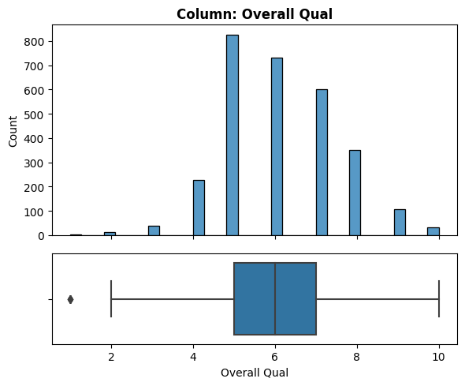
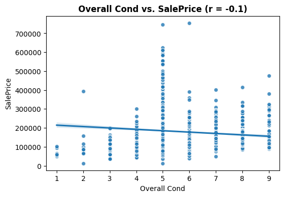
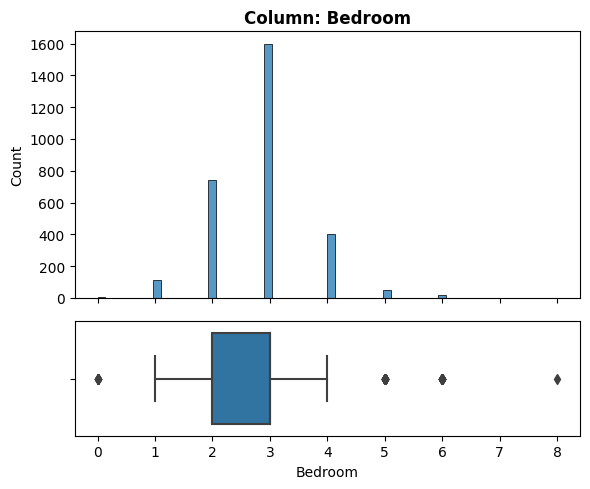
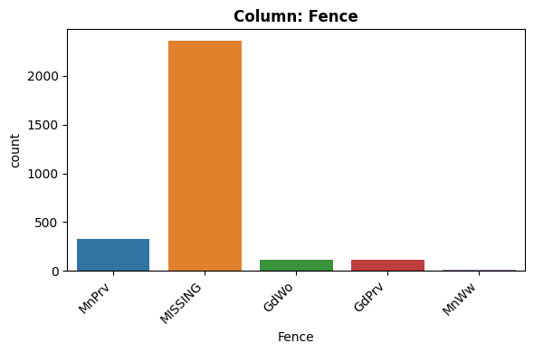
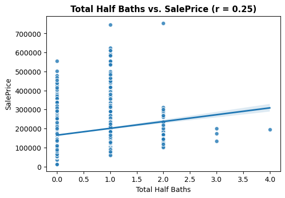
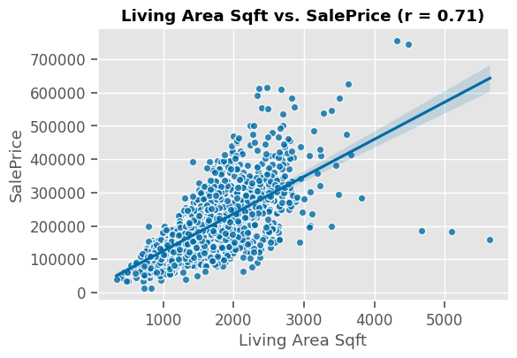

# Analyzing House Prices in Ames Iowa
Example Data Science Project Following CRISP-DM Workflow

<center>

<a href="https://dolinskigroup.com/buy-home/sellers-concessions">Image Source</a></center>
We've been hired by a group of homeowners who are concerned about the value of their homes decreasing before they sell them. They have asked us to take the raw house price data from their hometown, Ames, Iowa to be able to give them data-driven recommendations on how to best increase the value of their home.


We will be following the CRISP-DM workflow for our analysis.  

<center>


<a href="https://www.datascience-pm.com/crisp-dm-2">Image Source</a></center>


## Table of Contents

- [Phase 1) Business Understanding](#phase1)
- [Phase 2) Data Understanding](#phase2)
- [Phase 3) Data Preparation](#phase3)
- [Phase 4) Modeling](#phase4)
- [Phase 5) Evaluation](#phase5)
- [Phase 6) Deployment](#phase6)


<a name='phase1'></a>
# Phase 1) Business Understanding


**Our stakeholders are:**
- People who already own homes in Ames, Iowa

**Their primary goal is:**
- Increase the resale value of their homes.

**They plan to:**
- Modify/renovate their homes based on our analysis.

**What do they need/expect?**
- Actionable insights/recommendations for which modifications they can make to increase the price of their homes.

<a name='phase2'></a>
# Phase 2) Data Understanding


## 2.1) What data have we been provided?


<p>The stakeholders have provided us with two links:</p>
<ul><li> <a href="https://drive.google.com/file/d/1Jach7HsZVywhJnUJmkyqje52ho_0VJgo/view?usp=sharing" target="_blank">Share URL to a .csv file</a> <ul><li>A spreadsheet of various features of homes in their town, as well as the price of the house at the time of sale. </li></ul></li><li><a href="https://docs.google.com/document/d/1nmnel7g35aMOl0mKiSsTHXT8wRzbJ1EktKNqYFEmpWE/edit?usp=sharing" target="_blank">A Data Dictionary File</a><ul><li>A data dictionary is a document that lists the name and explanation for every feature in a dataset.</li></ul></li></ul>
<p>(Note, this is a modified version of the original Ames Iowa Housing dataset found on <a href="https://www.kaggle.com/datasets/marcopale/housing" target="_blank">Kaggle</a>)</p>

## 2.2) What information is included in the data?


- The file had 2,959 rows and 38 columns.
- There is a mixture of datatypes:
  - 8 float
  - 12 int
  - 18 object
- Since numeric features are sometimes stored as object dtype, we will inspect the object columns next and look for columns that should be converted.

- **Object columns that needed to be converted to numeric:**
  - [ ] Half Bath (had a "?"'s we replaced with NaN's
  - [ ] Living Area Sqft (had to remove the characters "sqft" from each row)


  
### **What is the meaning of each feature?**

Please see the <a href="https://docs.google.com/document/d/1nmnel7g35aMOl0mKiSsTHXT8wRzbJ1EktKNqYFEmpWE/edit?usp=sharing" target="_blank">Data Dictionary File</a> for full details.

#### Data Dictionary:
Please see the feature inspection section below for the definitions of the features that were included in the model. 


**After consulting the data dictionary, we noticed there are 2 features not included in the data dictionary:**
- [ ] **"Unnamed: 0"**: There is an erroneous index column that is not in the data dictionary, and should be dropped.


- [ ] **"PID"** column that is not included in the data dictionary.
  - Based on the preview above it looks like it may be a unique identifier, and can be either dropped or used as the index after checking for duplicates.


**There were several features with ambiguous column names.**
The following featurs were renamed for clarity:
  - "Year Remod/Add" -> "Year Remodeled"
  - "Bsmt Unf SF" -> "Bsmt Unf Sqft"
  - "Total Bsmt SF" -> "Total Bsmnt Sqft"
  - "TotRms AbvGrd" -> "Total Rooms"
  - "Gr Liv Area" -> "Living Area Sqft"


## **2.3) How clean is the data?**

### Are there missing values?

... 


- In the missingno matrix plot, we can see that there are only a few columns that have missing values. Of these columns, 2 seem to have primarily null values ("Alley" and "Fence"). 

- Below, we will display the null value counts and percentages for only the column with null values:

<table border="1" class="dataframe">
  <thead>
    <tr style="text-align: right;">
      <th></th>
      <th># Null</th>
      <th>% Null</th>
    </tr>
  </thead>
  <tbody>
    <tr>
      <th>Alley</th>
      <td>2732</td>
      <td>93.24</td>
    </tr>
    <tr>
      <th>Bsmt Unf Sqft</th>
      <td>1</td>
      <td>0.03</td>
    </tr>
    <tr>
      <th>Total Bsmnt Sqft</th>
      <td>1</td>
      <td>0.03</td>
    </tr>
    <tr>
      <th>Bsmt Full Bath</th>
      <td>2</td>
      <td>0.07</td>
    </tr>
    <tr>
      <th>Bsmt Half Bath</th>
      <td>2</td>
      <td>0.07</td>
    </tr>
    <tr>
      <th>Half Bath</th>
      <td>3</td>
      <td>0.10</td>
    </tr>
    <tr>
      <th>Garage Type</th>
      <td>157</td>
      <td>5.36</td>
    </tr>
    <tr>
      <th>Garage Yr Blt</th>
      <td>159</td>
      <td>5.43</td>
    </tr>
    <tr>
      <th>Garage Cars</th>
      <td>1</td>
      <td>0.03</td>
    </tr>
    <tr>
      <th>Garage Area</th>
      <td>1</td>
      <td>0.03</td>
    </tr>
    <tr>
      <th>Garage Qual</th>
      <td>159</td>
      <td>5.43</td>
    </tr>
    <tr>
      <th>Garage Cond</th>
      <td>159</td>
      <td>5.43</td>
    </tr>
    <tr>
      <th>Fence</th>
      <td>2358</td>
      <td>80.48</td>
    </tr>
  </tbody>
</table>

#### Null Value Observations:
- Alley and Fence have a large percentage of null values (93% and 80%, respectively).
- For Garage Columns (Garage Type, Garage Yr Built, Garage Qual, Garage Cond), the same rows are null values for all of these columns.
  - This likely indicates that these homes did not have a Garage.
  
  
### Are there duplicate rows?

- There were 7 duplicate rows that we dropped.

- There are 22 rows with duplicate PID's (44 total). 
  - In the 44 rows with duplicate PID rows, each duplicate had a duplicate PID that had a NaN for SalePrice.
    - A) We cannot have null values in SalePrice since it is our target, so we will drop null values from SalePrice only.
    - B) Also, by dropping the rows with null SalePrice, we may also remove the duplicate PID's.
  
  - So we first dropped null values from SalePrice and then confirmed there were no remiaining duplicate PID's.

...


### Are there any features with inconsistent values? (“yes” vs. “Yes”)

#### Categorical Features
**Central Air**: 
- There were a small number of values in the Central Air column that had "yes" instead of "Y" and "no" instead of "N."
```
Value Counts for Central Air
Y      2697
N       191
yes      37
no        5
Name: Central Air, dtype: int64
```
- [ ] We replaced the incorrect values with "Y" and "N."

#### Numeric Features

<table border="1" class="dataframe">
  <thead>
    <tr style="text-align: right;">
      <th></th>
      <th>Lot Frontage</th>
      <th>Lot Area</th>
      <th>Overall Qual</th>
      <th>Overall Cond</th>
      <th>Year Built</th>
      <th>Year Remodeled</th>
      <th>Bsmt Unf Sqft</th>
      <th>Total Bsmnt Sqft</th>
      <th>Living Area Sqft</th>
      <th>Bsmt Full Bath</th>
      <th>Bsmt Half Bath</th>
      <th>Full Bath</th>
      <th>Half Bath</th>
      <th>Bedroom</th>
      <th>Kitchen</th>
      <th>Total Rooms</th>
      <th>Garage Yr Blt</th>
      <th>Garage Cars</th>
      <th>Garage Area</th>
      <th>SalePrice</th>
    </tr>
  </thead>
  <tbody>
    <tr>
      <th>count</th>
      <td>2930.00</td>
      <td>2930.00</td>
      <td>2930.00</td>
      <td>2930.00</td>
      <td>2930.00</td>
      <td>2930.00</td>
      <td>2929.00</td>
      <td>2929.00</td>
      <td>2930.00</td>
      <td>2928.00</td>
      <td>2928.00</td>
      <td>2930.00</td>
      <td>2927.00</td>
      <td>2930.00</td>
      <td>2930.00</td>
      <td>2930.00</td>
      <td>2771.00</td>
      <td>2929.00</td>
      <td>2929.00</td>
      <td>2930.00</td>
    </tr>
    <tr>
      <th>mean</th>
      <td>57.48</td>
      <td>10147.92</td>
      <td>6.09</td>
      <td>5.56</td>
      <td>1971.36</td>
      <td>1984.27</td>
      <td>559.26</td>
      <td>1051.61</td>
      <td>1499.69</td>
      <td>0.43</td>
      <td>0.06</td>
      <td>1.57</td>
      <td>0.38</td>
      <td>2.85</td>
      <td>1.04</td>
      <td>6.44</td>
      <td>1978.13</td>
      <td>1.77</td>
      <td>472.82</td>
      <td>181439.40</td>
    </tr>
    <tr>
      <th>std</th>
      <td>33.79</td>
      <td>7880.02</td>
      <td>1.41</td>
      <td>1.11</td>
      <td>30.25</td>
      <td>20.86</td>
      <td>439.49</td>
      <td>440.62</td>
      <td>505.51</td>
      <td>0.52</td>
      <td>0.25</td>
      <td>0.55</td>
      <td>0.50</td>
      <td>0.83</td>
      <td>0.21</td>
      <td>1.57</td>
      <td>25.53</td>
      <td>0.76</td>
      <td>215.05</td>
      <td>86659.68</td>
    </tr>
    <tr>
      <th>min</th>
      <td>-1.00</td>
      <td>1300.00</td>
      <td>1.00</td>
      <td>1.00</td>
      <td>1872.00</td>
      <td>1950.00</td>
      <td>0.00</td>
      <td>0.00</td>
      <td>334.00</td>
      <td>0.00</td>
      <td>0.00</td>
      <td>0.00</td>
      <td>0.00</td>
      <td>0.00</td>
      <td>0.00</td>
      <td>2.00</td>
      <td>1895.00</td>
      <td>0.00</td>
      <td>0.00</td>
      <td>12789.00</td>
    </tr>
    <tr>
      <th>25%</th>
      <td>43.00</td>
      <td>7440.25</td>
      <td>5.00</td>
      <td>5.00</td>
      <td>1954.00</td>
      <td>1965.00</td>
      <td>219.00</td>
      <td>793.00</td>
      <td>1126.00</td>
      <td>0.00</td>
      <td>0.00</td>
      <td>1.00</td>
      <td>0.00</td>
      <td>2.00</td>
      <td>1.00</td>
      <td>5.00</td>
      <td>1960.00</td>
      <td>1.00</td>
      <td>320.00</td>
      <td>129500.00</td>
    </tr>
    <tr>
      <th>50%</th>
      <td>63.00</td>
      <td>9436.50</td>
      <td>6.00</td>
      <td>5.00</td>
      <td>1973.00</td>
      <td>1993.00</td>
      <td>466.00</td>
      <td>990.00</td>
      <td>1442.00</td>
      <td>0.00</td>
      <td>0.00</td>
      <td>2.00</td>
      <td>0.00</td>
      <td>3.00</td>
      <td>1.00</td>
      <td>6.00</td>
      <td>1979.00</td>
      <td>2.00</td>
      <td>480.00</td>
      <td>160000.00</td>
    </tr>
    <tr>
      <th>75%</th>
      <td>78.00</td>
      <td>11555.25</td>
      <td>7.00</td>
      <td>6.00</td>
      <td>2001.00</td>
      <td>2004.00</td>
      <td>802.00</td>
      <td>1302.00</td>
      <td>1742.75</td>
      <td>1.00</td>
      <td>0.00</td>
      <td>2.00</td>
      <td>1.00</td>
      <td>3.00</td>
      <td>1.00</td>
      <td>7.00</td>
      <td>2002.00</td>
      <td>2.00</td>
      <td>576.00</td>
      <td>213500.00</td>
    </tr>
    <tr>
      <th>max</th>
      <td>313.00</td>
      <td>215245.00</td>
      <td>10.00</td>
      <td>9.00</td>
      <td>2010.00</td>
      <td>2010.00</td>
      <td>2336.00</td>
      <td>6110.00</td>
      <td>5642.00</td>
      <td>3.00</td>
      <td>2.00</td>
      <td>4.00</td>
      <td>2.00</td>
      <td>8.00</td>
      <td>3.00</td>
      <td>15.00</td>
      <td>2207.00</td>
      <td>5.00</td>
      <td>1488.00</td>
      <td>2000000.00</td>
    </tr>
  </tbody>
</table>


##### **Notes on Numeric Feature Inconsistencies**

- **Lot Frontage**: has a minimum value of -1. 
  - This may be a placeholder value.
  - [ ] We replaced all the -1's with NaN's.

- **SalePrice**: The max value is much higher than the 75 percentile (\$2 million vs. \$213,500). 
  - [ ] After inspection, we decided this was not reasonable.
	- The Living Area Sqft for the \$2mill home is very small compared to the other most-expensive homes. 
789 sqft vs. 2,400 sqft (with a price of \$755,000).
	- This value is not realistic, and we decided to treat the \$2 million as a typo with an extra 0.
	- We replaced $2 million with $200,000.


- **Garage Yr Built**: has a max value of 2207, which is in many years into the future, and cannot be correct.
  - [ ] We replaced it with a null value.


### Do any features need to be combined or separated?
- **Date Sold**:  we split into 2 features  (Month, Year).
-  **"Bsmt Half Baths"/"Half Baths"**: were added together to make "Total Half Baths". The original features were dropped.
-  **"Bsmt Full Baths"/"Full Baths"**: were added together to make "Total Full Baths". The original features were dropped.
...


___

### Visualizing Each Feature

>Note: only the features that were used in the final model are included below. Please see the jupyter notebook for the full feature exploration.

The following features were dropped from the model for the reasons listed below:

| Feature Name | Reason Excluded |
| ---  | --- |
| 'Utilities' | Quasi-constant |
|"Street" | Quasi-constant |
|'MS Zoning'|Stakeholder can't change |
|'Lot Frontage'|  Stakeholder can't change|
|'Lot Area'| Stakeholder can't change|
|'Neighborhood'| Stakeholder can't change|
|'Year Built'| Stakeholder can't change|


#### Alley


- "Alley": Type of alley access to property
  - Grvl Gravel
  - Pave Paved
  - NA No alley access


    

    


    - NaN's Found: 2732 (93.24%)
    - Unique Values: 3
    - Most common value: 'MISSING' occurs 2732 times (93.24%)


**Things to check for each feature:**


1. What type of feature is it? (Categorical (nominal), ordinal, numeric)
  - Categorical (nominal)

2. How many null values? What percentage? What would you do with the null values (drop the rows? drop the column? impute? if impute, with what?)
  -  2732 null values (93.24%)
  - Impute with the category shown in the data dictionary (NA)


3. Is the feature constant or quasi-constant?
  - No.

4. What is the cardinality? Is it high?
  - Low (3).

5. Would we know this BEFORE the target is determined?
  - Yes

6. Is there a business case/understanding reason to exclude based on our business case?
  - It may be beyond homeowner's control.


    

    


- Feature vs. Target Observations:
  - Based on your business understanding, would you expect this feature to be a predictor of the target?
    - I would think paved alleys would get a higher price.
  - Does this feature appear to be a predictor of the target?
    - Possibly. 


#### Bldg Type


- "BldgType": Type of dwelling:
  - 1Fam Single-family Detached
  - 2FmCon Two-family Conversion; originally built as one-family dwelling
  - Duplx Duplex
  - TwnhsE Townhouse End Unit
  - TwnhsI Townhouse Inside Unit


```python
# Confirming the dtype to select correct EDA function
feature = "Bldg Type"
df[feature].dtype
```


    dtype('O')


    

    


    - NaN's Found: 0 (0.0%)
    - Unique Values: 5
    - Most common value: '1Fam' occurs 2425 times (82.76%)


**EDA Observations**

1. What type of feature is it? (Categorical (nominal), ordinal, numeric)
  - Categorical (nominal)

2. How many null values? What percentage? What would you do with the null values (drop the rows? drop the column? impute? if impute, with what?)
  - 0 null values.
  - No need to impute.

3. Is the feature constant or quasi-constant?
  - No.

4. What is the cardinality? Is it high?
  - Not applicable.

5. Would we know this BEFORE the target is determined?
  - Yes.

6. Is there a business case/understanding reason to exclude based on our business case?
  - The homeowner may be able to convert their home to a duplex, etc.


```python
plot_categorical_vs_target(df, feature);
```


    

    


- Feature vs. Target Observations:
  - Based on your business understanding, would you expect this feature to be a predictor of the target?
    - Yes.
  - Does this feature appear to be a predictor of the target?
    - Yes it does, though there is a wide range of sale prices for some of the building types.


#### House Style


- HouseStyle: Style of dwelling
  - 1Story One story
  - 1.5Fin One and one-half story: 2nd level finished
  - 1.5Unf One and one-half story: 2nd level unfinished
  - 2Story Two story
  - 2.5Fin Two and one-half story: 2nd level finished
  - 2.5Unf Two and one-half story: 2nd level unfinished
  - SFoyer Split Foyer
  - SLvl Split Level


```python
# Confirming the dtype to select correct EDA function
feature = "House Style"
df[feature].dtype
```


    dtype('O')


```python
explore_categorical(df, feature);
```


    

    


    - NaN's Found: 0 (0.0%)
    - Unique Values: 8
    - Most common value: '1Story' occurs 1481 times (50.55%)


**EDA Observations**

1. What type of feature is it? (Categorical (nominal), ordinal, numeric)
  - Categorical (nominal)

2. How many null values? What percentage? What would you do with the null values (drop the rows? drop the column? impute? if impute, with what?)
  - 0 null values.
  - No need to impute.

3. Is the feature constant or quasi-constant?
  - No.

4. What is the cardinality? Is it high?
  - ~medium cardinality (8)

5. Would we know this BEFORE the target is determined?
  - Yes.

6. Is there a business case/understanding reason to exclude based on our business case?
  - No, the homeowner could remodel their home to change this.


```python
plot_categorical_vs_target(df, feature);
```


    

    


- Feature vs. Target Observations:
  - Based on your business understanding, would you expect this feature to be a predictor of the target?
    - Yes.
  - Does this feature appear to be a predictor of the target?
    - Possibily, but it is hard to tell due to the range of values within some of the categories.


#### Overall Qual


- "OverallQual": Overall material and finish quality
  -  10: Very Excellent
  -  9: Excellent
  -  8: Very Good
  -  7: Good
  -  6: Above Average
  -  5: Average
  -  4: Below Average
  -  3: Fair
  -  2: Poor
  -  1: Very Poor


    

    


    - NaN's Found: 0 (0.0%)
    - Unique Values: 10
    - Most common value: '5' occurs 825 times (28.16%)


**EDA Observations**

1. What type of feature is it? (Categorical (nominal), ordinal, numeric)
  - Ordinal (but already numeric)

2. How many null values? What percentage? What would you do with the null values (drop the rows? drop the column? impute? if impute, with what?)
  - 0 null values.

3. Is the feature constant or quasi-constant?
  - No.

4. What is the cardinality? Is it high?
  - Not applicable.

5. Would we know this BEFORE the target is determined?
  - Yes.

6. Is there a business case/understanding reason to exclude based on our business case?
  - No.


    

    


- Feature vs. Target Observations:
  - Based on your business understanding, would you expect this feature to be a predictor of the target?
    - Yes
  - Does this feature appear to be a predictor of the target?
    - Yes!

#### Overall Cond


- "OverallCond": Overall condition rating
  -  10: Very Excellent
  -  9: Excellent
  -  8: Very Good
  -  7: Good
  -  6: Above Average
  -  5: Average
  -  4: Below Average
  -  3: Fair
  -  2: Poor
  -  1: Very Poor

    

    


    - NaN's Found: 0 (0.0%)
    - Unique Values: 9
    - Most common value: '5' occurs 1654 times (56.45%)


**EDA Observations**

1. What type of feature is it? (Categorical (nominal), ordinal, numeric)
  - Ordinal, already numeric datatype. (No encoding needed).

2. How many null values? What percentage? What would you do with the null values (drop the rows? drop the column? impute? if impute, with what?)
  - 0 null values.

3. Is the feature constant or quasi-constant?
  - No.

4. What is the cardinality? Is it high?
  - 9, not high, especially since it will treated as a numeric feature.

5. Would we know this BEFORE the target is determined?
  - Yes.

6. Is there a business case/understanding reason to exclude based on our business case?
  - No.


    

    


- Feature vs. Target Observations:
  - Based on your business understanding, would you expect this feature to be a predictor of the target?
    - Yes.
  - Does this feature appear to be a predictor of the target?
    - Not really. The trendline is somewhat flat and the correlation is low.


#### Year Remodeled


- "Year Remodeled" (renamed from original "YearRemodAdd"): 
  - Remodel date (same as construction date if no remodeling or additions)


    

    


    - NaN's Found: 0 (0.0%)
    - Unique Values: 61
    - Most common value: '1950' occurs 361 times (12.32%)


**EDA Observations**

1. What type of feature is it? (Categorical (nominal), ordinal, numeric)
  - Numeric

2. How many null values? What percentage? What would you do with the null values (drop the rows? drop the column? impute? if impute, with what?)
  - 0

3. Is the feature constant or quasi-constant?
  - No.

4. What is the cardinality? Is it high?
  - Not applicable (numeric feature).

5. Would we know this BEFORE the target is determined?
  - Yes.

6. Is there a business case/understanding reason to exclude based on our business case?
  - No! This is very helpful feature, since our stakeholders are open to remodeling.


    

    


- Feature vs. Target Observations:
  - Based on your business understanding, would you expect this feature to be a predictor of the target?
    - Yes.
  - Does this feature appear to be a predictor of the target?
    - Yes, there is a positive correlation between this and the target.


#### Exter Qual


- ExterQual: Exterior material quality
  - Ex: Excellent
  - Gd: Good
  - TA: Average/Typical
  - Fa: Fair
  - Po: Poor


    

    


    - NaN's Found: 0 (0.0%)
    - Unique Values: 4
    - Most common value: 'TA' occurs 1799 times (61.4%)


**EDA Observations**

1. What type of feature is it? (Categorical (nominal), ordinal, numeric)
  - Ordinal.

2. How many null values? What percentage? What would you do with the null values (drop the rows? drop the column? impute? if impute, with what?)
  - 0 null values

3. Is the feature constant or quasi-constant?
  - No.

4. What is the cardinality? Is it high?
  - Low (only 4 unique values).

5. Would we know this BEFORE the target is determined?
  - Yes.

6. Is there a business case/understanding reason to exclude based on our business case?
  - No.


    

    


- Feature vs. Target Observations:
  - Based on your business understanding, would you expect this feature to be a predictor of the target?
    - Yes.
  - Does this feature appear to be a predictor of the target?
    - Very much so!


#### Exter Cond


- ExterCond: Present condition of the material on the exterior
  - Ex: Excellent
  - Gd: Good
  - TA: Average/Typical
  - Fa: Fair
  - Po: Poor

    

    


    - NaN's Found: 0 (0.0%)
    - Unique Values: 5
    - Most common value: 'TA' occurs 2549 times (87.0%)


**EDA Observations**

1. What type of feature is it? (Categorical (nominal), ordinal, numeric)
  - Ordinal

2. How many null values? What percentage? What would you do with the null values (drop the rows? drop the column? impute? if impute, with what?)
  - 0

3. Is the feature constant or quasi-constant?
  - No, but TA is very common (87% of feature)

4. What is the cardinality? Is it high?
  - Low, only 5.

5. Would we know this BEFORE the target is determined?
  - Yes.

6. Is there a business case/understanding reason to exclude based on our business case?
  - No.


    

    


- Feature vs. Target Observations:
  - Based on your business understanding, would you expect this feature to be a predictor of the target?
    - Yes.
  - Does this feature appear to be a predictor of the target?
    - Possibily, but the range of values for TA is very broad.


#### Bsmt Unf Sqft


- "BsmtUnfSF": Unfinished square feet of basement area


    

    


    - NaN's Found: 1 (0.03%)
    - Unique Values: 1137
    - Most common value: '0.0' occurs 244 times (8.33%)


**EDA Observations**

1. What type of feature is it? (Categorical (nominal), ordinal, numeric)
  - Numeric

2. How many null values? What percentage? What would you do with the null values (drop the rows? drop the column? impute? if impute, with what?)
  - 1 null value (0.03%)

3. Is the feature constant or quasi-constant?
  - No.

4. What is the cardinality? Is it high?
  - Not applicable (numeric).

5. Would we know this BEFORE the target is determined?
  - Yes.

6. Is there a business case/understanding reason to exclude based on our business case?
  - No.


    - NaN's Found: 1 (0.03%)


    

    


- Feature vs. Target Observations:
  - Based on your business understanding, would you expect this feature to be a predictor of the target?
    - Possibly, but unfinished basement would likely be less desirable than finished basement. 
  - Does this feature appear to be a predictor of the target?
    - Not very, low correlation.


#### Total Bsmnt Sqft


- "TotalBsmtSF": Total square feet of basement area


    

    


    - NaN's Found: 1 (0.03%)
    - Unique Values: 1058
    - Most common value: '0.0' occurs 79 times (2.7%)


**EDA Observations**

1. What type of feature is it? (Categorical (nominal), ordinal, numeric)
  - Numeric

2. How many null values? What percentage? What would you do with the null values (drop the rows? drop the column? impute? if impute, with what?)
  - 1 null (0.03%)

3. Is the feature constant or quasi-constant?
  - No.

4. What is the cardinality? Is it high?
  - Not applicable, numeric.

5. Would we know this BEFORE the target is determined?
  - Yes

6. Is there a business case/understanding reason to exclude based on our business case?
  - No


    - NaN's Found: 1 (0.03%)


    

    


- Feature vs. Target Observations:
  - Based on your business understanding, would you expect this feature to be a predictor of the target?
    - Yes.
  - Does this feature appear to be a predictor of the target?
    - Yes it does. 


#### Central Air


- "CentralAir": Central air conditioning
  - N: No
  - Y: Yes


    

    


    - NaN's Found: 0 (0.0%)
    - Unique Values: 2
    - Most common value: 'Y' occurs 2734 times (93.31%)


**EDA Observations**

1. What type of feature is it? (Categorical (nominal), ordinal, numeric)
  - Categorical.

2. How many null values? What percentage? What would you do with the null values (drop the rows? drop the column? impute? if impute, with what?)
  - 0

3. Is the feature constant or quasi-constant?
  - No, but most homes have central air (93%)
4. What is the cardinality? Is it high?
  - Very low (2)

5. Would we know this BEFORE the target is determined?
  - Yes.

6. Is there a business case/understanding reason to exclude based on our business case?
  - No.


    

    


- Feature vs. Target Observations:
  - Based on your business understanding, would you expect this feature to be a predictor of the target?
    - Yes, central air is a very desirable trait. 
  - Does this feature appear to be a predictor of the target?
    - Yes.


#### Living Area Sqft


- "Living Area Sqft" (renamed from original  "GrLivArea"): 
  - Above grade (ground) living area square feet


    

    


    - NaN's Found: 0 (0.0%)
    - Unique Values: 1292
    - Most common value: '864.0' occurs 41 times (1.4%)


**EDA Observations**

1. What type of feature is it? (Categorical (nominal), ordinal, numeric)
  - Numeric

2. How many null values? What percentage? What would you do with the null values (drop the rows? drop the column? impute? if impute, with what?)
  - 0 null values.

3. Is the feature constant or quasi-constant?
  - No.

4. What is the cardinality? Is it high?
  - Not applicable (numeric)

5. Would we know this BEFORE the target is determined?
  - Yes.

6. Is there a business case/understanding reason to exclude based on our business case?
  - No.


    

    


- Feature vs. Target Observations:
  - Based on your business understanding, would you expect this feature to be a predictor of the target?
    - Yes, square footage is a critical house trait.
  - Does this feature appear to be a predictor of the target?
    - Yes!


#### Bedroom


- "Bedroom": Number of bedrooms above basement level


    

    


    - NaN's Found: 0 (0.0%)
    - Unique Values: 8
    - Most common value: '3' occurs 1597 times (54.51%)


**EDA Observations**

1. What type of feature is it? (Categorical (nominal), ordinal, numeric)
  - Numeric.

2. How many null values? What percentage? What would you do with the null values (drop the rows? drop the column? impute? if impute, with what?)
  - 0 null values.

3. Is the feature constant or quasi-constant?
  - No.

4. What is the cardinality? Is it high?
  - Not applicable (numeric)

5. Would we know this BEFORE the target is determined?
  - Yes.

6. Is there a business case/understanding reason to exclude based on our business case?
  - No.


    

    


- Feature vs. Target Observations:
  - Based on your business understanding, would you expect this feature to be a predictor of the target?
    - Yes, I would think more bedrooms is better.
  - Does this feature appear to be a predictor of the target?
    - Possibly, though it is suprising that the largest number of bedrooms has a lower price.


#### Kitchen


- "Kitchen": Number of kitchens


    

    


    - NaN's Found: 0 (0.0%)
    - Unique Values: 4
    - Most common value: '1' occurs 2796 times (95.43%)


**EDA Observations**

1. What type of feature is it? (Categorical (nominal), ordinal, numeric)
  - Numeric

2. How many null values? What percentage? What would you do with the null values (drop the rows? drop the column? impute? if impute, with what?)
  - 0 null values.

3. Is the feature constant or quasi-constant?
  - No.

4. What is the cardinality? Is it high?
  - Not applicable (numeric).

5. Would we know this BEFORE the target is determined?
  - Yes

6. Is there a business case/understanding reason to exclude based on our business case?
  - No.


    

    


- Feature vs. Target Observations:
  - Based on your business understanding, would you expect this feature to be a predictor of the target?
    - I would think that having more kitchens would lead to a higher price.
  - Does this feature appear to be a predictor of the target?
    - Possibly, but there is a negative correlation when we would expect positive.


#### Total Rooms


- "Total Rooms" (renamed from original "TotRmsAbvGrd"):
  -  Total rooms above grade (does not include bathrooms)


    

    


    - NaN's Found: 0 (0.0%)
    - Unique Values: 14
    - Most common value: '6' occurs 844 times (28.81%)


**EDA Observations**

1. What type of feature is it? (Categorical (nominal), ordinal, numeric)
  - Numeric.

2. How many null values? What percentage? What would you do with the null values (drop the rows? drop the column? impute? if impute, with what?)
  - 0 null values.

3. Is the feature constant or quasi-constant?
  - No

4. What is the cardinality? Is it high?
  - Not applicable (numeric).

5. Would we know this BEFORE the target is determined?
  - Yes.

6. Is there a business case/understanding reason to exclude based on our business case?
  - No.


    

    


- Feature vs. Target Observations:
  - Based on your business understanding, would you expect this feature to be a predictor of the target?
    - Yes.
  - Does this feature appear to be a predictor of the target?
    - Yes it has a strong positive correlation to the target.


#### Garage Type


- "GarageType": Garage location:
  - 2Types: More than one type of garage
  - Attchd: Attached to home
  - Basment: Basement Garage
  - BuiltIn: Built-In (Garage part of house - typically has room above garage)
  - CarPort: Car Port
  - Detchd" Detached from home
  - NA: No Garage


    

    


    - NaN's Found: 157 (5.36%)
    - Unique Values: 7
    - Most common value: 'Attchd' occurs 1731 times (59.08%)


**EDA Observations**

1. What type of feature is it? (Categorical (nominal), ordinal, numeric)
  - Categorical.

2. How many null values? What percentage? What would you do with the null values (drop the rows? drop the column? impute? if impute, with what?)
  - 157 (5.35%)

3. Is the feature constant or quasi-constant?
  - No.

4. What is the cardinality? Is it high?
  - Low-Medium (7)

5. Would we know this BEFORE the target is determined?
  - Yes.

6. Is there a business case/understanding reason to exclude based on our business case?
  - No.


    

    


- Feature vs. Target Observations:
  - Based on your business understanding, would you expect this feature to be a predictor of the target?
    - Yes.
  - Does this feature appear to be a predictor of the target?
    - Yes, but there is a broad range of values for some of the categories.


#### Garage Yr Blt


- GarageYrBlt: Year garage was built


    

    


    - NaN's Found: 160 (5.46%)
    - Unique Values: 102
    - Most common value: 'nan' occurs 160 times (5.46%)


**EDA Observations**

1. What type of feature is it? (Categorical (nominal), ordinal, numeric)
  - Numeric.

2. How many null values? What percentage? What would you do with the null values (drop the rows? drop the column? impute? if impute, with what?)
  - 160 null values (5.46%)

3. Is the feature constant or quasi-constant?
  - No.

4. What is the cardinality? Is it high?
  - Not applicable (numeric).

5. Would we know this BEFORE the target is determined?
  - Yes.

6. Is there a business case/understanding reason to exclude based on our business case?
  - No.


    - NaN's Found: 160 (5.46%)


    

    


- Feature vs. Target Observations:
  - Based on your business understanding, would you expect this feature to be a predictor of the target?
    - Yes, more recent garages are probably more appealing.
  - Does this feature appear to be a predictor of the target?
    - Yes it does! Recent garage yr builts, especially.


#### Garage Cars


- GarageCars: Size of garage in car capacity


    

    


    - NaN's Found: 1 (0.03%)
    - Unique Values: 6
    - Most common value: '2.0' occurs 1603 times (54.71%)


**EDA Observations**

1. What type of feature is it? (Categorical (nominal), ordinal, numeric)
  - Numeric.

2. How many null values? What percentage? What would you do with the null values (drop the rows? drop the column? impute? if impute, with what?)
  - 1 (0.03%)

3. Is the feature constant or quasi-constant?
  - No.

4. What is the cardinality? Is it high?
  - Not applicable (numeric).

5. Would we know this BEFORE the target is determined?
  - Yes.

6. Is there a business case/understanding reason to exclude based on our business case?
  - No.


    - NaN's Found: 1 (0.03%)


    

    


- Feature vs. Target Observations:
  - Based on your business understanding, would you expect this feature to be a predictor of the target?
    -  Yes I expect more cars are more desirable. 
  - Does this feature appear to be a predictor of the target?
    - Yes!


#### Garage Area


- GarageArea: Size of garage in square feet

    

    


    - NaN's Found: 1 (0.03%)
    - Unique Values: 603
    - Most common value: '0.0' occurs 157 times (5.36%)


**EDA Observations**

1. What type of feature is it? (Categorical (nominal), ordinal, numeric)
  - Numeric.

2. How many null values? What percentage? What would you do with the null values (drop the rows? drop the column? impute? if impute, with what?)
  - 1 null value (0.03%)

3. Is the feature constant or quasi-constant?
  - No.

4. What is the cardinality? Is it high?
  - Not applicable (numeric).

5. Would we know this BEFORE the target is determined?
  - Yes.

6. Is there a business case/understanding reason to exclude based on our business case?
  - No.


    - NaN's Found: 1 (0.03%)


    

    


- Feature vs. Target Observations:
  - Based on your business understanding, would you expect this feature to be a predictor of the target?
    - Yes, similar to garage cars.
  - Does this feature appear to be a predictor of the target?
    - Yes.


#### Garage Qual


- "GarageQual": Garage quality:
  - Ex: Excellent
  - Gd: Good
  - TA: Typical/Average
  - Fa: Fair
  - Po: Poor
  - NA: No Garage

    

    


    - NaN's Found: 159 (5.43%)
    - Unique Values: 6
    - Most common value: 'TA' occurs 2615 times (89.25%)


**EDA Observations**

1. What type of feature is it? (Categorical (nominal), ordinal, numeric)
  - Ordinal.

2. How many null values? What percentage? What would you do with the null values (drop the rows? drop the column? impute? if impute, with what?)
  - 159 (5.43%)

3. Is the feature constant or quasi-constant?
  - No, but  89% of the values are TA.

4. What is the cardinality? Is it high?
  - Low (6)

5. Would we know this BEFORE the target is determined?
  - Yes

6. Is there a business case/understanding reason to exclude based on our business case?
  - No


    


- Feature vs. Target Observations:
  - Based on your business understanding, would you expect this feature to be a predictor of the target?
    - Yes.
  - Does this feature appear to be a predictor of the target?
    - Possibly, but the range of values in TA is broad.


#### Garage Cond


- "GarageCond": Garage condition:
  - Ex: Excellent
  - Gd: Good
  - TA: Typical/Average
  - Fa: Fair
  - Po: Poor
  - NA: No Garage


    

    


    - NaN's Found: 159 (5.43%)
    - Unique Values: 6
    - Most common value: 'TA' occurs 2665 times (90.96%)


**EDA Observations**

1. What type of feature is it? (Categorical (nominal), ordinal, numeric)
  - Ordinal

2. How many null values? What percentage? What would you do with the null values (drop the rows? drop the column? impute? if impute, with what?)
  - 159 (5.43%)

3. Is the feature constant or quasi-constant?
  - No, but  91% of the values are TA.

4. What is the cardinality? Is it high?
  - Low, 6

5. Would we know this BEFORE the target is determined?
  - Yes.

6. Is there a business case/understanding reason to exclude based on our business case?
  - No.


    

    


- Feature vs. Target Observations:
  - Based on your business understanding, would you expect this feature to be a predictor of the target?
    - Yes.
  - Does this feature appear to be a predictor of the target?
    - Possibly, but the rnage of values in TA is broad.


#### Paved Drive


- PavedDrive: Paved driveway
  - Y: Paved
  - P: Partial Pavement
  - N: Dirt/Gravel


    

    


    - NaN's Found: 0 (0.0%)
    - Unique Values: 3
    - Most common value: 'Y' occurs 2652 times (90.51%)


**EDA Observations**

1. What type of feature is it? (Categorical (nominal), ordinal, numeric)
  - Categorical.

2. How many null values? What percentage? What would you do with the null values (drop the rows? drop the column? impute? if impute, with what?)
  - 0 null values.

3. Is the feature constant or quasi-constant?
  - No, but 90% of the values are "Y"

4. What is the cardinality? Is it high?
  - Low (3)

5. Would we know this BEFORE the target is determined?
  - Yes.

6. Is there a business case/understanding reason to exclude based on our business case?
  - No, the homeowner can get their driveway paved.


    

    


- Feature vs. Target Observations:
  - Based on your business understanding, would you expect this feature to be a predictor of the target?
    - Yes.
  - Does this feature appear to be a predictor of the target?
    - Yes.


#### Fence


- "Fence": Fence quality:
  - GdPrv: Good Privacy
  - MnPrv: Minimum Privacy
  - GdWo: Good Wood
  - MnWw: Minimum Wood/Wire
  - NA: No Fence


    

    


    - NaN's Found: 2358 (80.48%)
    - Unique Values: 5
    - Most common value: 'MISSING' occurs 2358 times (80.48%)


**EDA Observations**

1. What type of feature is it? (Categorical (nominal), ordinal, numeric)
  - Categorical

2. How many null values? What percentage? What would you do with the null values (drop the rows? drop the column? impute? if impute, with what?)
  - 2,358 null values (80.48%)

3. Is the feature constant or quasi-constant?
  - No.

4. What is the cardinality? Is it high?
  - Low (5)

5. Would we know this BEFORE the target is determined?
  - Yes.

6. Is there a business case/understanding reason to exclude based on our business case?
  - No.

    

    


- Feature vs. Target Observations:
  - Based on your business understanding, would you expect this feature to be a predictor of the target?
    - Yes.
  - Does this feature appear to be a predictor of the target?
    - Possibly, but the rnage of sale prices for homes missing a value for fench is very wide.


#### SalePrice


- SalePrice - the property's sale price in dollars. This is the target variable that you're trying to predict for this challenge.


    

    


    - NaN's Found: 0 (0.0%)
    - Unique Values: 1032
    - Most common value: '135000.0' occurs 34 times (1.16%)


**EDA Observations**

1. What type of feature is it? (Categorical (nominal), ordinal, numeric)
  - Our Target (numeric)

2. How many null values? What percentage? What would you do with the null values (drop the rows? drop the column? impute? if impute, with what?)
  - 0.

3. Is the feature constant or quasi-constant?
  - No.

4. What is the cardinality? Is it high?
  - Not applicable.

5. Would we know this BEFORE the target is determined?
  - No! It IS the target!

6. Is there a business case/understanding reason to exclude based on our business case?
  - No.


#### Month


- Month Sold


    

    


    - NaN's Found: 0 (0.0%)
    - Unique Values: 12
    - Most common value: '6.0' occurs 505 times (17.24%)


**EDA Observations**

1. What type of feature is it? (Categorical (nominal), ordinal, numeric)
  - numeric/ordinal

2. How many null values? What percentage? What would you do with the null values (drop the rows? drop the column? impute? if impute, with what?)
  - 0 null values.

3. Is the feature constant or quasi-constant?
  - No

4. What is the cardinality? Is it high?
  - Medium (12)

5. Would we know this BEFORE the target is determined?
  - No, we wouldn't know what month the sale will happen.

6. Is there a business case/understanding reason to exclude based on our business case?
  - Yes, the homeowner can't control the sale date of their home.


    

    


- Feature vs. Target Observations:
  - Based on your business understanding, would you expect this feature to be a predictor of the target?
    - Not sure.
  - Does this feature appear to be a predictor of the target?
    - No.


#### Year


- Year Sold


    

    


    - NaN's Found: 0 (0.0%)
    - Unique Values: 5
    - Most common value: '2007.0' occurs 694 times (23.69%)


**EDA Observations**

1. What type of feature is it? (Categorical (nominal), ordinal, numeric)
  - Numeric

2. How many null values? What percentage? What would you do with the null values (drop the rows? drop the column? impute? if impute, with what?)
  - 0 null values.

3. Is the feature constant or quasi-constant?
  - No.

4. What is the cardinality? Is it high?
  - Not applicable (numeric)

5. Would we know this BEFORE the target is determined?
  - No, also, these years are long ago and may not be helpful in predicting with current/modern years.

6. Is there a business case/understanding reason to exclude based on our business case?
  - Yes, also not fully under the homeowner's control, but also because the housing market from this time period does not account for modern yearly trends in price.


    

    


- Feature vs. Target Observations:
  - Based on your business understanding, would you expect this feature to be a predictor of the target?
    - No.
  - Does this feature appear to be a predictor of the target?
    - No.


#### Total Full Baths


- Engineered: Combined Full Baths + Bsmnt Full Baths


    

    


    - NaN's Found: 2 (0.07%)
    - Unique Values: 6
    - Most common value: '2.0' occurs 1477 times (50.41%)


**EDA Observations**

1. What type of feature is it? (Categorical (nominal), ordinal, numeric)
  - Numeric.

2. How many null values? What percentage? What would you do with the null values (drop the rows? drop the column? impute? if impute, with what?)
  - 2 (0.07%)

3. Is the feature constant or quasi-constant?
  - No.

4. What is the cardinality? Is it high?
  - Not applicable (numeric).

5. Would we know this BEFORE the target is determined?
  - Yes.

6. Is there a business case/understanding reason to exclude based on our business case?
  - No.


    - NaN's Found: 2 (0.07%)


    

    


- Feature vs. Target Observations:
  - Based on your business understanding, would you expect this feature to be a predictor of the target?
    - Yes, I would expect the more full baths the higher the price.
  - Does this feature appear to be a predictor of the target?
    - Yes! Strong positive correlation.


#### Total Half Baths

- Engineered: Combined Half Baths + Bsmnt Half Baths

    

    


    - NaN's Found: 5 (0.17%)
    - Unique Values: 5
    - Most common value: '0.0' occurs 1706 times (58.23%)


**EDA Observations**

1. What type of feature is it? (Categorical (nominal), ordinal, numeric)
  - Numeric.

2. How many null values? What percentage? What would you do with the null values (drop the rows? drop the column? impute? if impute, with what?)
  - 5 (0.17%)

3. Is the feature constant or quasi-constant?
  - No. 

4. What is the cardinality? Is it high?
  - Not applicable (numeric)

5. Would we know this BEFORE the target is determined?
  - Yes.

6. Is there a business case/understanding reason to exclude based on our business case?
  - No.


    - NaN's Found: 5 (0.17%)


    

    


- Feature vs. Target Observations:
  - Based on your business understanding, would you expect this feature to be a predictor of the target?
    - Yes, I would think more of any type of bathroom would increase price.
  - Does this feature appear to be a predictor of the target?
    - Somewhat, but it loks like having more than 2 half baths decrease the home value?

<a name='phase3'></a>

# Phase 3) Data Preparation

## Preprocessing (By Feature Type)

### Numeric Features
- The following features were processed as numeric features:
	- 'Overall Qual', 'Overall Cond', 'Year Remodeled', 'Bsmt Unf Sqft',
            'Total Bsmnt Sqft', 'Living Area Sqft', 'Bedroom', 'Kitchen',
            'Total Rooms', 'Garage Yr Blt', 'Garage Cars', 'Garage Area', 'Month',
            'Year', 'Total Full Baths', 'Total Half Baths'

- Missing values were imputed with the median.

- The data was sacled using StandardScaler. 

### Ordinal Features
- The following features were processed as ordinal features:
	- 'Exter Qual','Exter Cond', 'Garage Qual',"Garage Cond"
- Missing values were imputed using a placeholder value "NA".
- All 4 features had the same ordinal categories ('NA','Po', 'Fa', 'TA', 'Gd', 'Ex')and were encoded using OrdinalEncoder.
- The ordinally-encoded features were then scaled using StandardScaler

### Categorical (Nominal) Features
- The following features were processed as categorical features:
	- 'Alley', 'Bldg Type', 'House Style', 'Central Air', 'Garage Type',
            'Paved Drive', 'Fence'
- Missing values were imputed using a placeholder value "NA".
- The features were then encoded with OneHotEncoder.


# Phase 4) Modeling


## Linear Regression

```
------------------------------------------------------------
Regresion Metrics: Training Data
------------------------------------------------------------
MAE = 21,158.21
MSE = 1,151,857,608.08
RMSE = 33,939.03
R^2 = 0.83
------------------------------------------------------------
Regresion Metrics: Test Data
------------------------------------------------------------
MAE = 19,928.76
MSE = 850,685,987.08
RMSE = 29,166.52
R^2 = 0.83
```


## Random Forest

```
------------------------------------------------------------
Regresion Metrics: Training Data
------------------------------------------------------------
MAE = 6,236.45
MSE = 108,781,002.52
RMSE = 10,429.81
R^2 = 0.98
------------------------------------------------------------
Regresion Metrics: Test Data
------------------------------------------------------------
MAE = 17,097.82
MSE = 779,491,429.10
RMSE = 27,919.37
R^2 = 0.84
```


<a name='phase5'></a>
# Phase 5) Evaluation

### Best Model
>**Which model/result(s) should we provide to our stakeholders?**

- While our Random Forest model had the best performance on the training data ( R^2=0.98 and RMSE = \$ 10,756.37), the test performance was much lower (R^2 = 0.84, RMSE= \$ 27,797.16 ). It was very over fit to the training data, even after tuning max_depth.

- While the LinearRegression performed worse on the training data compared to the RandomForest (R^2=0.83, RMSE = \$ 33,939.03),tt performed equally well on the training and test data (R^2 = 0.83, RMSE = 29,166.52). 
It was not overfit and had consistent performance.


> **Do the results meet the stakeholder’s success criteria?**


Not quite yet. Our stakeholders wanting some insights and recommendations, as well. (See phase 6 below).

<a name='phase6'></a>
# Phase 6) Deployment (Recommendations)


### Overall Quality 


    

    


- The overall quality of the materials of the home were strongly correlated with higher Sale price. 


- We recommend paying for higher quality construction materials when remodeling your home, to increase its Sale Price.

### Living Area Sqft


    

    


- The size of the living area (in square-feet) was also strongly positively correlated with Sale Price. 


- We recommend expanding the size of your living area in your home. This could be done by adding on to the home, or by repurposing unifinished areas of the home into liveable space.


### Central Air


    

    


```
Central Air
N    101890.479592
Y    186483.877835
Name: SalePrice, dtype: float64
```


- Homes that have Central Air conditioning sell for ~\$85,000 more than homes without central air.


- We recommend adding Central Air conditioning to your home, if you do not have it already.